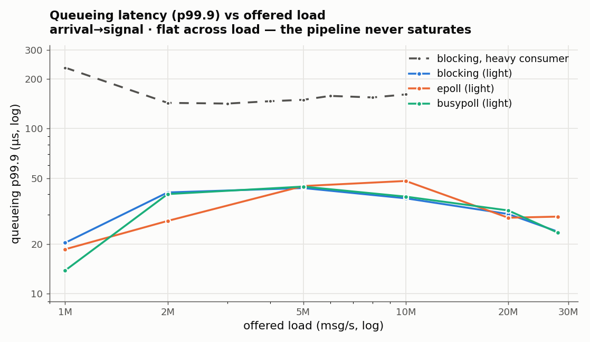

# A low-latency market-data pipeline, measured

UDP receive → MoldUDP64 framing → ITCH 5.0 parse → limit-order-book update →
signal, built as a five-rung ladder and measured at every stage with `rdtscp`.
Dataset: `12302019.NASDAQ_ITCH50` (Nasdaq TotalView-ITCH, 2019-12-30, 8.3 GB,
268,744,780 messages). The book is reconstructed for one symbol (AAPL, stock
locate 13) and its top-of-book is checked **byte-for-byte against an independent
oracle** (1,512,180 rows) at every rung.

> This is a loopback study. There is no NIC, no wire, no propagation delay. Every
> latency here is the **software** path only; where that changes the interpretation,
> it is called out rather than dressed up. No aspirational targets — numbers,
> regimes, and honest attribution.

---

## 1. Pipeline

```
  ┌─────────────┐    UDP / loopback    ┌──────────────┐
  │   sender    │  ─────────────────▶  │   receive    │   one of four I/O paths:
  │  ITCH file  │      127.0.0.1       │  (I/O path)  │   blocking · epoll ·
  │   → Mold64  │        :27502        │              │   busy-poll · io_uring
  └─────────────┘                      └──────┬───────┘
    core 7                                    │  core 6 (isolated)
                                              ▼
     ┌───────────┐     ┌───────────┐     ┌──────────┐     ┌───────────┐
     │ MoldUDP64 │ ──▶ │   ITCH    │ ──▶ │   book    │ ──▶ │  signal   │
     │  deframe  │     │  parse    │     │  update   │     │ microprice│
     │ (seq/gap) │     │           │     │           │     │           │
     └───────────┘     └───────────┘     └──────────┘     └───────────┘
     └──────────────── recv ──────────┘ └── parse ─┘ └─ book ─┘ └ signal ┘
                     measured per stage, offline percentiles
```

The sender (separate process, pinned core 7) reads the ITCH file, frames messages
into MoldUDP64 packets, and blasts them over loopback UDP. The receiver (pinned
core 6) pulls them, deframes, checks sequence numbers for gaps, and feeds the
parse → book → signal inner pipeline. The inner pipeline is **identical across all
four I/O paths** — only how bytes arrive changes.

---

## 2. Methodology

**Timer.** `rdtscp` + trailing `lfence` (serialize so the stamp can't float past
the code it bounds). TSC is invariant at 4.69 GHz. Two calibrations at startup:
`ns/cycle` against `CLOCK_MONOTONIC` over a 200 ms window, and the timer's own
overhead (min of 1,000 back-to-back stamp pairs, ~47 cycles) which is subtracted
from every measurement.

**Per-stage, not end-to-end-only.** Each message is stamped at four points
(before parse, after parse, after book, after signal), so parse/book/signal are
isolated. `recv` is stamped per batch (it is a batched syscall — see below) and
attributed per message.

**Interference hygiene.** Cores 6, 7 are `isolcpus` + `nohz_full` + `rcu_nocbs`
(SMT siblings 14, 15). Receiver and sender on separate isolated cores. `mlockall`
+ pre-faulted buffers (zero page faults on the hot path). Zero allocation and zero
I/O on the hot path — the measurement ring is preallocated and written offline.

**Sample size.** Percentiles (p50/p99/p99.9) computed offline from the full run:
1,512,180 AAPL samples for parse/book/signal; ~900–1,800 batch samples for recv.

**Two runs, because one run can't be honest about everything.** The instrumented
build (5 `rdtscp` per message) cannot sustain wide-open line rate, so:
- parse/book/signal come from a **rate-limited full run** (clean, 1.5 M samples,
  rate-independent);
- recv comes from a **backpressure slice** that fits entirely in the socket buffer,
  so packets are always queued and the recv stamp measures real syscall work, not
  idle inter-arrival wait.

The two runs agree on parse/book/signal, which validates the split.

**A caveat, stated once.** The `performance` governor was not pinned (it needs
privilege in this environment), so under load the core ran ~2.42 GHz, not max
turbo. TSC-derived ns are still correct wall-clock; they just reflect a
non-boosted core. Absolute numbers would shrink with the governor pinned; the
*relative* comparison between paths — the point of the study — is unaffected.

---

## 3. Rung 1 — parser + book

**Parser.** Branch-on-message-type over the ITCH 5.0 layout; fields read with a
single templated big-endian reader (`read_be<N>`) instead of a family of
byte-swap helpers. Parse-all, book-one: every message is parsed, but only AAPL
mutates the book (locate compare is one branch).

**Book.** The hot structures are chosen for the access pattern, not generality:
- **Intrusive doubly-linked lists** for orders within a price level — O(1) unlink
  on cancel/execute with no node allocation (prev/next live in the `Order`).
- **Pool allocators** for orders and levels — a free-list of preallocated slots,
  so add/delete never touch the system allocator on the hot path.
- **`ankerl::unordered_dense`** for order-id → slot (open-addressing, dense
  storage) — chosen over `std::unordered_map` for cache-friendly lookups, which
  is the per-message-dominant operation.
- **`std::map` per side** for price → level, so best-bid/ask is `rbegin()`/
  `begin()` in O(1)-amortized and levels stay sorted.

**Per-stage latency** (rdtscp, overhead-subtracted, 1.5 M AAPL samples):

| Stage | p50 | p99 | p99.9 |
|---|---|---|---|
| parse | 20 ns | 30 ns | 30 ns |
| book | 70 ns | 301 ns | 771 ns |
| signal | 20 ns | 30 ns | 30 ns |

Parse and signal are flat (fixed work, cache-resident). The book's tail
(p99.9 = 771 ns) is the allocator/map work on the rare add-to-new-price-level and
cancel-empties-level paths; the p50 (70 ns) is the common hash-lookup-and-adjust.

**perf** (saturated, 446 K samples): user-space `parser()` is 32.8% of self-cycles,
the inline book/signal loop 9.8%; the rest is the kernel receive path. Under load,
**parsing is the bottleneck**, not the book. IPC 2.4, branch-miss 1.5%, L1-miss
2.5% — the inner pipeline is cache-friendly.

---

## 4. Rungs 2–4 — the I/O ladder

The same feed, received four ways, measured identically. A shared frontend
(`frontend.h`) owns deframe + sequence check + pipeline + measurement; each path
is a thin acquisition loop that answers only *"what bytes arrived, and how long
did acquiring them cost."*

**Framing (Rung 2).** MoldUDP64: 20-byte header (10 B session · 8 B seq BE · 2 B
count) then N `[2 B len][ITCH payload]` blocks, ≤ 1400 B/packet. The sequence
field makes gap detection possible; the receiver tracks `expected_seq` and logs
(never recovers) a gap — detect-only by design.

**The buffer-tuning lesson.** First full-blast run dropped 2 packets (~8,145
messages) when a burst overran the stock 208 KB socket buffer — and the book
diverged from the oracle *permanently* from that point. One dropped AAPL message
corrupts the book forever, which is why gaps = 0 is a hard gate. The fix was one
OS tunable (`net.core.rmem_max` → 128 MB), not code: the receiver already
requested 32 MB `SO_RCVBUF`; the kernel was clamping it. This is the single most
predictable failure of a UDP feed handler.

**Four-way comparison** (backpressure, saturated loopback; recv/msg is the fair
cross-path metric):

| Path | acquire / batch | recv / msg | parse·book·signal |
|---|---|---|---|
| Rung 2 blocking `recvmmsg` | 17.5 µs | 5 ns | 20 · 70 · 20 ns |
| Rung 3 epoll | +200 ns `epoll_wait`, 17.6 µs recv | 5 ns | (identical) |
| Rung 4A busy-poll | 16.4 µs, spins = 0 | 5 ns | (identical) |
| Rung 4B io_uring | 7.4 µs `submit_and_wait` | 4 ns | (identical) |
| Rung 4B io_uring + SQPOLL | **190 ns** `submit_and_wait` | ~0 ns | (identical) |

**Same latency, different cost** (`perf stat`, full file @ 5 M msg/s):

| Path | ctx-switches | instructions | CPU util |
|---|---|---|---|
| blocking | 6.05 M | 119 B | 0.375 |
| epoll | 6.05 M | 130 B (+9%) | 0.389 |
| busy-poll | **1** | **752 B (6.3×)** | **1.000** |
| io_uring | 6.05 M | 123 B | 0.371 |
| io_uring + SQPOLL | 6.05 M (reader) | 1,165 B | 1.346 (poll thread pegs core 5) |

**Per-path attribution:**
- **Blocking (baseline) — 5 ns/msg.** One `recvmmsg` folds readiness + recv + copy
  into a single syscall amortized over ~2,985 msgs/batch. Already near the floor.
- **epoll — lost.** A readiness syscall (`epoll_wait`) blocking folds away: +9%
  instructions for identical work; ~0 ns/msg under load but +200 ns per ~44 msgs at
  1-packet batches. Never wins on one socket.
- **busy-poll — tied on latency, 6.3× the cost.** `spins = 0` means the channel was
  saturated, so its one advantage (skipping the scheduler park on the empty→data
  edge) never fired. It eliminates context-switches by burning a whole core spinning.
- **io_uring — won on submit (7.4 µs vs 17 µs/batch), tied on recv/msg (4 ns).** The
  lower submit cost is partly bookkeeping: the packet copy already happened in kernel
  task-work; `submit_and_wait` only reaps completions. Work moved, not erased.
- **io_uring + SQPOLL — submit is free (190 ns, zero syscalls), costs a core.** A
  dedicated poll thread on core 5 (100% busy, 69 s sys) does submission + copy; the
  reader just reads the completion ring. You trade one CPU for a near-zero submit path.

**The finding.** On a single saturated loopback socket, the syscall strategy does
**not** move per-message latency — all paths land at 0–5 ns/msg because batching
amortizes the syscall to noise and the kernel copy path (`skb` dequeue +
`copy_to_user`) is the shared floor everyone pays. The mechanisms differ only in
what they *spend* — CPU (busy-poll, SQPOLL) or instructions (epoll) — to reshape
*when* the work happens. That points at what a real optimization would have to
attack: the copy path itself (kernel-bypass), which is out of scope here (§6).

---

## 5. Stress chart — queueing latency vs offered load *(centerpiece)*

The four-way table (§4) is a single operating point: a saturated channel. The
question that a stress chart answers is what happens to **tail latency as offered
load climbs**. To measure that honestly you have to capture the one thing the
per-stage stamps in §2–4 cannot: **queueing delay** — how long a packet waits in
the socket buffer before it is processed. Processing cost (parse 20 ns, book 70 ns)
is load-independent; queueing is not. So this section adds a kernel RX timestamp
(`SO_TIMESTAMPNS`) and reports **end-to-end arrival→signal latency** per AAPL
message across a load sweep (sender's rate knob, `sendmmsg`, up to ~28 M msg/s —
its ceiling).



**Finding 1 — it's flat. The pipeline never saturates.** Across the entire
achievable range (1 M → 28 M msg/s) queueing p99.9 stays bounded (~20–45 µs) with
**zero drops on every path**. There is no knee, and that absence is the result: the
single-threaded receive pipeline sustains ~28 M msg/s, and one loopback sender
cannot offer more, so the receiver is never driven past capacity. The three I/O
paths (blocking, epoll, busy-poll) cluster within measurement noise — the same
conclusion as §4, now across load rather than at one point: **the I/O strategy does
not move latency here.**

**Finding 2 — consumer weight, not offered load, sets the floor.** The dashed line
is the same blocking path with a **heavier per-message consumer** (the fully
`rdtscp`-instrumented pipeline). It sits ~4× higher (~140–160 µs p99.9) and is
*also* flat. Load slides the curve nowhere; making each message cost more slides the
whole floor up. That is the real lever — and it points, again, at per-message work
(the copy path, the book), not at the syscall.

**Why there is no knee, stated plainly.** A saturation knee requires offered load
to exceed receive capacity. On loopback I can't get there: I upgraded the sender to
`sendmmsg` (3× faster, ~28 M msg/s) and I lowered receive capacity with a heavier
consumer, and the channel still would not saturate — every run finished with
`gaps = 0`. Producing a genuine knee would need a faster load generator (multiple
senders, or a kernel-bypass flood) or a real NIC, where per-packet cost is higher
and interrupt/wakeup latency is real. This is the same honesty as the wire-time
caveat (§1): the loopback harness cannot manufacture a bottleneck it doesn't have,
and I would rather report the flat truth than dress up a knee that isn't there.

**Saturation / throughput (the Fig 5b question).** Because nothing drops, the
throughput cliff is not in reach: all four paths sustain **≥ 28 M msg/s with zero
loss**, and the ceiling is the *sender's*, not any receiver's. The single-threaded
pipeline is not the throughput bottleneck on loopback — a result worth stating
because it means the decoupling optimizations (SPSC queue, strategy thread) that a
faster feed would justify have no measured reason to exist yet (§7).

*Reproduce:* `SO_TIMESTAMPNS` probe builds `rung{2,3,4a}_qbench` (light) and
`rung{2,3,4a}_qm` (heavy); sweep via `--rate/--duration`; data in
`results/stress_sweep.csv` + `results/stress_knee.csv`; plotted offline.

---

## 6. Why I didn't build AF_XDP

I considered it and chose not to, because on this harness it can't show its real
win. In generic/SKB mode on loopback, AF_XDP still traverses the kernel network
stack and then adds userspace-ring bookkeeping on top — slower than io_uring **by
construction**, so a loopback AF_XDP number would be a strawman. The genuine win is
**native mode on a supported NIC**: zero-copy DMA straight into userspace umem,
bypassing the `copy_to_user` that §4 identifies as the shared floor — which is a
different sprint gated on hardware acquisition and driver support (XDP-native
`ndo_bpf`), not a loopback exercise. Knowing *when* the comparison is meaningful is
the point; half-implementing it in the mode where it loses would signal the
opposite. The upgrade path is concrete: native AF_XDP + a Mellanox/Intel NIC with
zero-copy umem, or `ef_vi` / DPDK for full kernel-bypass — all attacking the copy
path, which is where the measured bottleneck actually is.

---

## 7. Next optimizations

In rough order of expected payoff on *this* measured bottleneck (the kernel copy
path and the single-thread inline pipeline):

- **Kernel-bypass receive** — native AF_XDP (zero-copy umem), `ef_vi`, or DPDK.
  This is the only class of change that attacks the shared floor from §4; everything
  above it in the ladder only reshapes syscall/scheduler cost.
- **Lock-free producer→consumer handoff** — an SPSC ring from the receive thread to
  a strategy thread, decoupling parse/book from signal so a slow consumer can't
  backpressure receive. Deferred until a rung had a measured reason; a real NIC would
  provide it.
- **Hardware timestamping** — NIC RX timestamps to measure true wire-to-software
  latency (impossible on loopback), closing the honesty gap this study is explicit about.
- **busy-poll with NAPI tuning** — `SO_BUSY_POLL` budget + `gro_flush_timeout` /
  `napi_defer_hard_irqs` on a real NIC, where busy-poll's interrupt-avoidance
  actually pays (it can't on loopback — §4).
- **Parser microarchitecture** — parsing is the user-space bottleneck under load
  (§3 perf); SIMD field extraction or a computed-goto dispatch are the levers if the
  copy path is ever removed and parse becomes the wall.

---

*Correctness gate for every rung: top-of-book byte-identical to the oracle across
all 1,512,180 AAPL rows. No rung is "done" until that diff is empty.*

